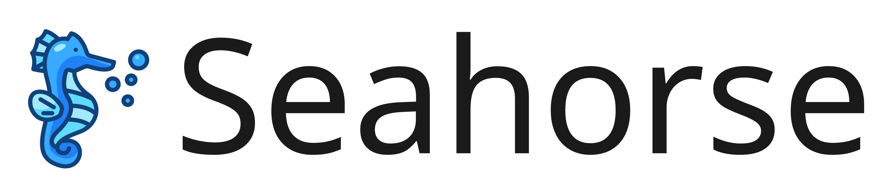

<h1>
  
</h1>

[English](README.md) | [中文](README.zh-cn.md) | [한국어](README.ko.md) | [日本語](README.ja.md)

  
  
  

A pure python autonomous driving framework

 

## Related works

- [PythonRobotics](https://github.com/AtsushiSakai/PythonRobotics) Python codes for robotics algorithm
- [Awesome Robotic Tooling](https://github.com/protontypes/awesome-robotic-tooling) A curated list of tooling for professional robotic development

## Online Practice

- [Traffic light detection](https://huggingface.co/spaces/daohu527/seahorse)
- [Planning](https://mattbradley.github.io/dash/)

## Design

You might be surprised that this autonomous driving system was developed in python. I know the speed is slow and can't guarantee real time, but its benefits are also obvious. It's easy to add features, verify algorithms, structure data, visualize and so on.

So this is probably the best project for **teaching and research** in the field of autonomous driving. Although this is a bit of an overstatement, we still want it to be the matlab of autonomous driving.

We call it the `seahorse`, small and delicate. Enjoy it and action now!!!

## Architecture

The following is the software block diagram of seahorse, which integrates various algorithm libraries for autonomous driving and supports a variety of middleware through the wrappar layer. At the same time, it also provides a rich API interface to connect to the simulation system.

We hope it will be an autonomous driving system with rich algorithm support, simple use, and standard interfaces.

